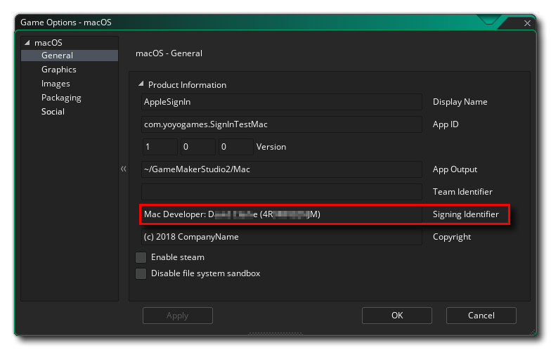

@title Setup

# Setup

To test your apps, you'll need to use the latest beta version of Xcode 11 and update your devices to 
the latest OS versions (which may require you to update to beta versions).

Additionally, for macOS, to use this extension you will be required to provide a **Signing Identifier** in the 
[macOS Game Options](https://manual.yoyogames.com/Settings/Game_Options/macOS.htm):

And you will also need to check the **Enable Sign In With Apple** checkbox in the **Social** section:

Also note that if you are compiling for macOS using the **VM** and *not* the YYC, then Xcode will not be 
used and so you need to take an extra step to ensure that your game will function correctly. This 
requires you to retrieve a **Provisioning Profile** for your game
(see the article [Download manual provisioning profiles](https://help.apple.com/xcode/mac/current/#/deva899b4fe5) for more information)
and add it into GameMaker as an [included file](https://manual.yoyogames.com/Settings/Included_Files.htm):

This profile should be valid for the **App ID**, **Team Identifier** and **Signing Identifier** used in the [Game Options](https://manual.yoyogames.com/Settings/Game_Options/macOS.htm).

Once you have everything set up, it's simply a case of adding a button object into your game and having 
it call the appropriate functions when pressed, and then parsing the ${event.social} to get the necessary data from the callback.

[[WARNING: This functionality cannot be tested by running the game from the GameMaker IDE
and it is required that you create an executable for the target platform to properly test.]]